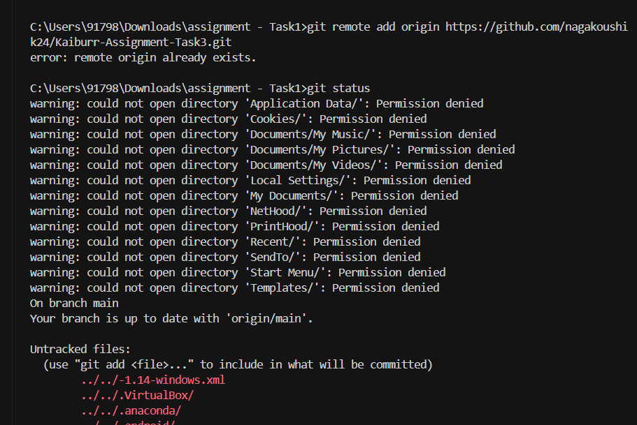
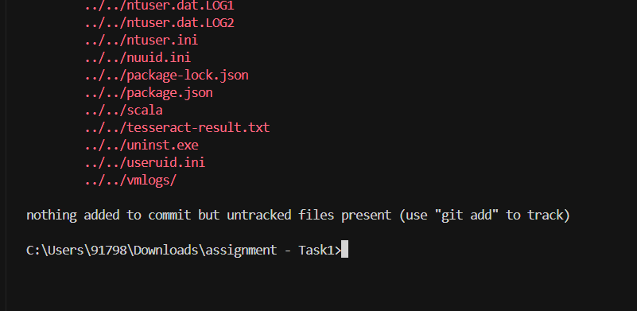
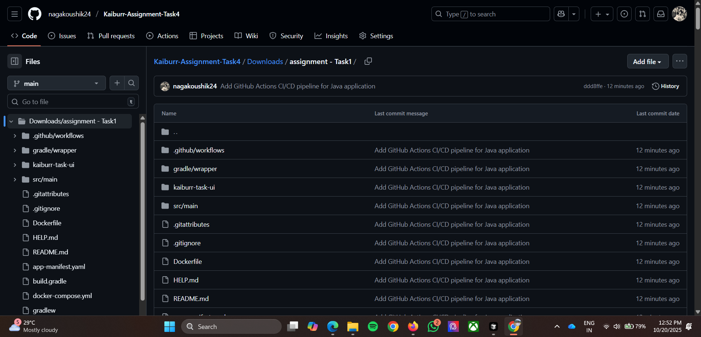
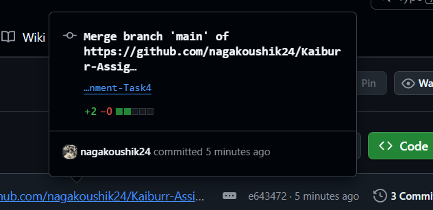
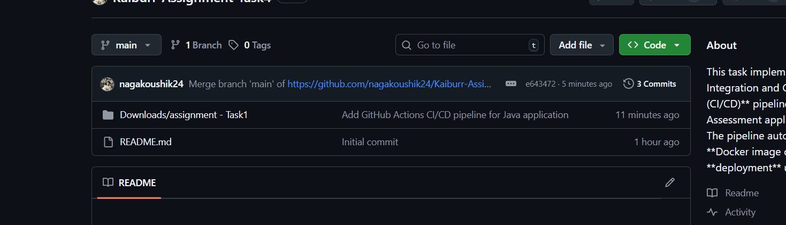

# Kaiburr Task Management System

A complete task management system with Java Spring Boot backend and React frontend, featuring CI/CD pipeline with GitHub Actions and Docker containerization.

## 🚀 Features

### Backend (Spring Boot + MongoDB)
- **REST API** for task management (CRUD operations)
- **Command Execution** with shell command validation
- **Execution History** tracking with timestamps and output
- **MongoDB Integration** for data persistence
- **CORS Support** for frontend communication
- **Memory Optimized** for low-resource environments

### Frontend (React + TypeScript + Ant Design)
- **Modern UI** with responsive design
- **Real-time Statistics** dashboard
- **Task Management** with search and filtering
- **Command Execution** with live feedback
- **Accessibility** features and keyboard navigation
- **Error Handling** with user-friendly messages

### CI/CD Pipeline
- **Automated Build** with Maven
- **Docker Containerization** with multi-stage builds
- **GitHub Actions** workflow
- **Docker Hub** integration
- **Automated Testing** and validation

## 📋 API Endpoints

| Method | Endpoint | Description |
|--------|----------|-------------|
| `GET` | `/tasks` | Get all tasks |
| `GET` | `/tasks?id={id}` | Get task by ID |
| `GET` | `/tasks/findByName?name={name}` | Search tasks by name |
| `PUT` | `/tasks` | Create new task |
| `DELETE` | `/tasks?id={id}` | Delete task |
| `PUT` | `/tasks/execute?taskId={id}` | Execute task command |

## 🛠️ Local Development

### Prerequisites
- Java 17+
- Maven 3.6+
- MongoDB 4.4+
- Node.js 18+
- npm or yarn

### Backend Setup

1. **Clone the repository:**
   ```bash
   git clone <repository-url>
   cd assignment-Task1
   ```

2. **Start MongoDB:**
   ```bash
   # Windows (if installed as service)
   net start MongoDB
   
   # Or start manually
   mongod
   ```

3. **Run the backend:**
   ```bash
   # Using the batch file (recommended for low memory)
   .\run-backend-ultra-minimal.bat
   
   # Or manually with Maven
   mvn spring-boot:run -Dspring-boot.run.jvmArguments="-Xmx128m -Xms64m -XX:+UseSerialGC"
   ```

4. **Verify backend:**
   - Open `http://localhost:8080/tasks` in browser
   - Should return JSON data

### Frontend Setup

1. **Navigate to frontend directory:**
   ```bash
   cd kaiburr-task-ui
   ```

2. **Install dependencies:**
   ```bash
   npm install
   ```

3. **Start development server:**
   ```bash
   npm run dev
   ```

4. **Open application:**
   - Navigate to `http://localhost:5173`
   - You should see the task management UI

## 🐳 Docker Deployment

### Build and Run with Docker

1. **Build the Docker image:**
   ```bash
   docker build -t task-api .
   ```

2. **Run the container:**
   ```bash
   docker run -p 8080:8080 -e SPRING_DATA_MONGODB_URI=mongodb://host.docker.internal:27017/assignment task-api
   ```

3. **With Docker Compose (recommended):**
   ```bash
   docker-compose up -d
   ```

## 🔄 CI/CD Pipeline Setup

### Prerequisites

1. **Docker Hub Account:**
   - Create account at [Docker Hub](https://hub.docker.com/)
   - Create a public repository (e.g., `task-api`)

2. **GitHub Secrets:**
   - Go to your GitHub repository
   - Navigate to Settings → Secrets and variables → Actions
   - Add the following secrets:
     - `DOCKERHUB_USERNAME`: Your Docker Hub username
     - `DOCKERHUB_TOKEN`: Your Docker Hub access token

### Pipeline Features

The CI/CD pipeline automatically:

1. **Code Build:**
   - Checks out code
   - Sets up Java 17
   - Caches Maven dependencies
   - Builds application with Maven
   - Runs tests

2. **Docker Build:**
   - Logs into Docker Hub
   - Builds Docker image
   - Pushes image to registry
   - Uses multi-stage build for optimization

### Manual Trigger

You can manually trigger the pipeline:
1. Go to Actions tab in GitHub
2. Select "Java CI-CD Pipeline"
3. Click "Run workflow"

## 📁 Project Structure

```
assignment-Task1/
├── .github/
│   └── workflows/
│       └── main.yml              # GitHub Actions workflow
├── src/
│   └── main/
│       ├── java/
│       │   └── com/kaiburr/assignment/
│       │       ├── AssignmentApplication.java
│       │       ├── config/
│       │       │   └── CorsConfig.java
│       │       ├── controller/
│       │       │   └── TaskController.java
│       │       ├── models/
│       │       │   ├── Task.java
│       │       │   └── TaskExecution.java
│       │       ├── repository/
│       │       │   └── TaskRepository.java
│       │       └── service/
│       │           └── TaskService.java
│       └── resources/
│           └── application.properties
├── kaiburr-task-ui/              # React frontend
│   ├── src/
│   │   ├── App.tsx
│   │   ├── api.ts
│   │   └── types.ts
│   ├── package.json
│   └── README.md
├── Dockerfile                    # Docker configuration
├── .dockerignore                 # Docker ignore file
├── pom.xml                       # Maven configuration
├── run-backend.bat              # Backend startup script
├── run-backend-ultra-minimal.bat # Low memory startup script
└── README.md                     # This file
```

## 🔧 Configuration

### Backend Configuration

Edit `src/main/resources/application.properties`:

```properties
# MongoDB connection
spring.data.mongodb.uri=mongodb://localhost:27017/assignment
spring.data.mongodb.database=assignment

# Server port
server.port=8080

# Logging
logging.level.com.kaiburr.assignment=DEBUG
```

### Frontend Configuration

Edit `kaiburr-task-ui/src/api.ts`:

```typescript
const apiClient = axios.create({
  baseURL: 'http://localhost:8080/tasks',  // Backend URL
  // ... other config
});
```

## 🧪 Testing

### Backend Tests
```bash
mvn test
```

### Frontend Tests
```bash
cd kaiburr-task-ui
npm test
```

## Screenshorts of Output


 
 
 
 

